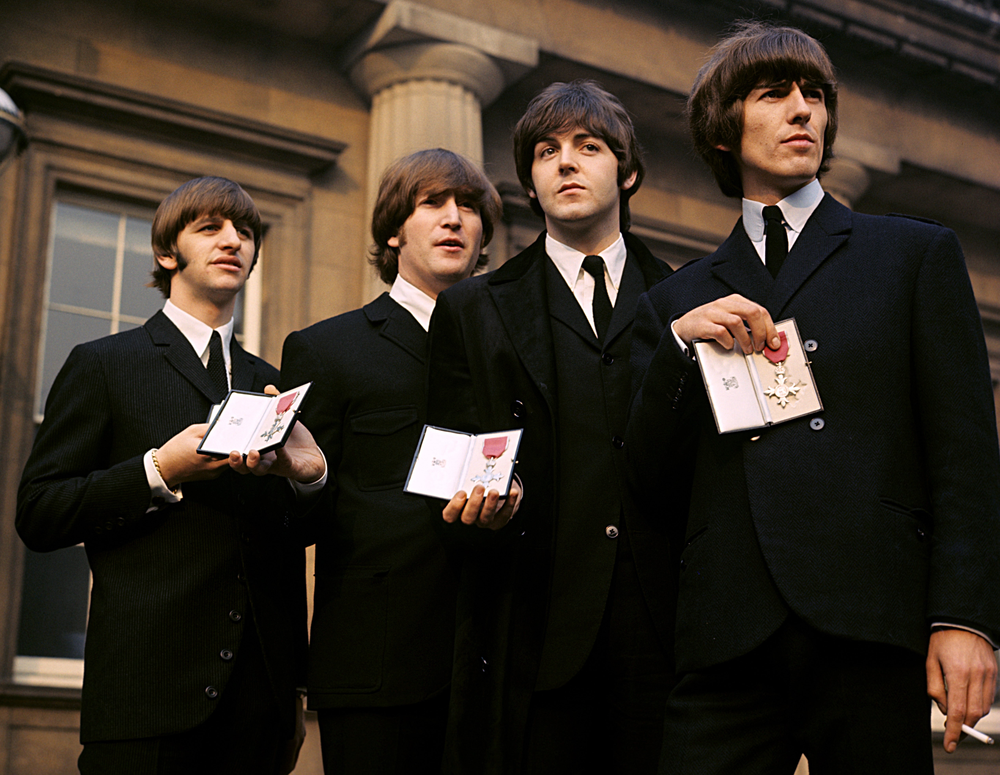
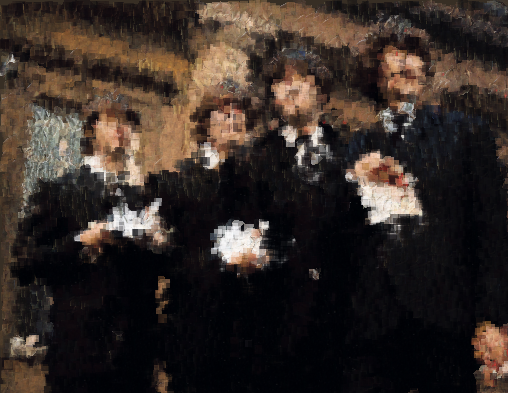

# Superpixel Reconstruction
Reconstruct images from the superpixels of a set of images that do not contain the image to be reconstructed.

  
   
  
   
  Reconstructed with the superpixels from the images below
   
  
   
  

## Summary

The project involves reconstructing images from the superpixels of a set of images that do not contain the image being recreated. The SLIC (Simple Linear Iterative Clustering) algorithm is used to obtain the superpixels of the images. The reconstruction is carried out using Simulated Annealing, with the aim of minimizing the mean squared error (or maximizing the structural similarity index measure) between the target image and the reconstructed image.

## How it works

To know about how it works, the methodology followed, the methods proposed and implemented, read the report.

[Report](report_en.pdf)

